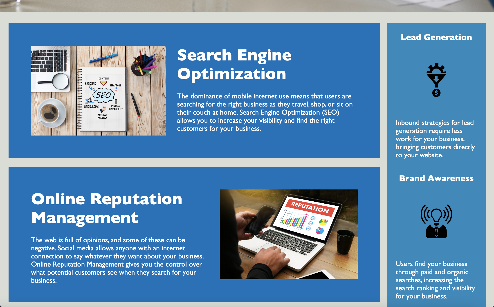
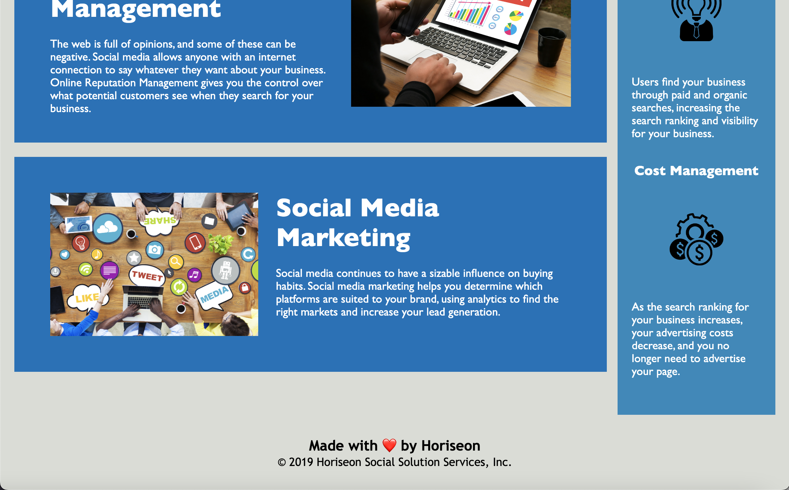

# fantastic-horiseon-refactor

## Horiseon Accessibility Refactor

## HTML IMPROVEMENTS:

The HTML code for Horiseon's webpage was edited to increase accessibility. The main changes made were as listed: elements were updated to semantic html, alt attributes were added with image descriptions, and the webpage title element was updated.
While editing the HTML I also checked to ensure that the header elements were in sequential order and that the structure of the HTML elements was logical. Lastly, I fixed a broken navigation link by adding the missing ID into section code.

## CSS IMPROVEMENTS:

While the styling for the webpage all worked correctly, some of the styles were formed into multiple classes that were repetitive and unnecessary. I summed up the repeated style code into a single class called and updated the HTML. 
These changes were done in the main information section and in the benefits section.

## Link

https://github.com/charliec1665/fantastic-horiseon-refactor

## Screenshots of Finished Application

## Acknowledgements

The starting code for this project was cloned from Xandromus (Xander Rapstine) on Github. https://github.com/Xandromus

## License

This project and webpage are copyright by Horiseon Social Solution Services, Inc.
